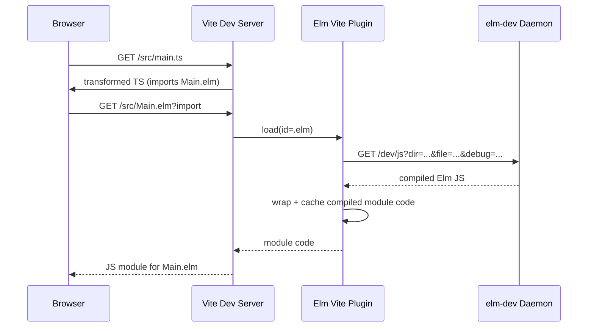
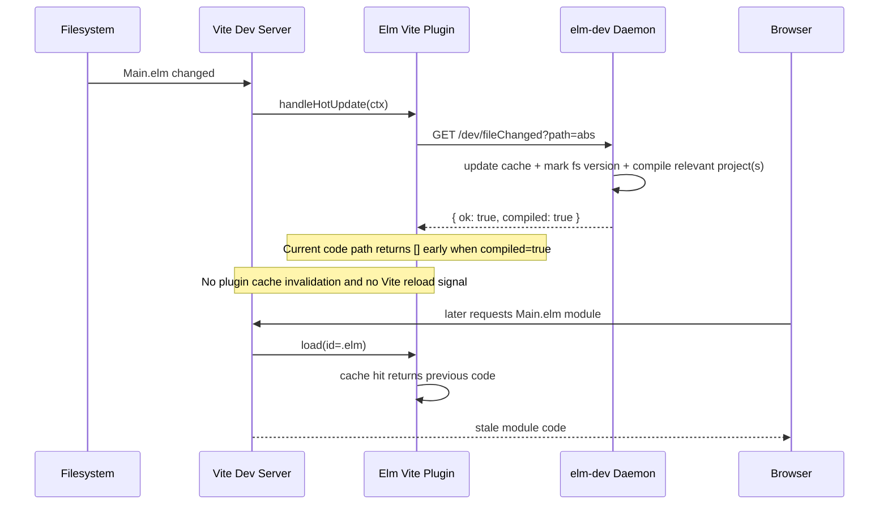
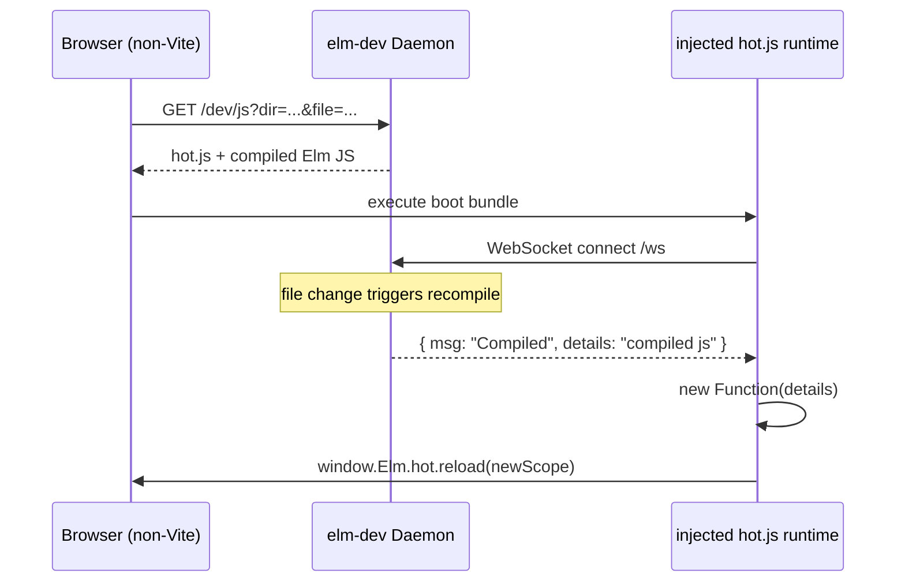

# Vite + elm-dev Information Flow Spec

This document describes the runtime data flow when using `elm-dev` through the Vite plugin (`apps/ts-tool/vite.mjs` and `installers-elm-dev/npm/ts-tool/vite.mjs`).

It also clarifies ownership boundaries so we can fix stale-update bugs in the right place.

## Scope

- Vite plugin path for `.elm` imports
- `elm-dev` daemon endpoints used by the plugin
- HMR/update signaling paths
- Where stale compiles can originate

## Components

- Browser App Runtime: your app code (`src/main.ts`, Elm runtime, etc.)
- Vite Client Runtime: `@vite/client` websocket + HMR protocol
- Vite Dev Server: module graph + plugin container
- Elm Vite Plugin: `vite-plugin-elm-dev` (`apps/ts-tool/vite.mjs`)
- elm-dev Daemon HTTP: `/dev/js`, `/dev/fileChanged`
- elm-dev Daemon WS: `/ws` (`ext-watchtower/Watchtower/Server/DevWS.hs`)

## Responsibility Model

- `elm-dev` daemon is the source of compiled Elm artifacts and compile status.
- Vite/plugin is the source of truth for browser module invalidation and HMR signaling in a Vite session.
- Browser reflects changes only after Vite decides modules are invalid and sends an update/full-reload over Vite's HMR socket.

That means daemon compile success is necessary but not sufficient for browser freshness under Vite.

## Two Distinct Realtime Channels

1. Vite HMR websocket (`@vite/client`)
   - Owned by Vite
   - Drives module replacement/reload in the browser

2. elm-dev websocket (`ws://.../ws`)
   - Owned by daemon
   - Broadcasts daemon-level messages (`Compiled`, `CompilationError`, etc.) from `Watchtower.Server.DevWS`

These are separate protocols. The daemon websocket does not automatically mutate Vite's module graph.

## Initial Load Flow

## File Change Flow (Current)

## Why stale behavior is possible

- Plugin caches transformed Elm code in `compilationCache` in `apps/ts-tool/vite.mjs`.
- `load()` serves cached code immediately when present.
- On hot update, current fast path (`result.ok && result.compiled`) returns before invalidating plugin cache/module graph.
- Therefore daemon can compile fresh output while Vite still serves old transformed module.

## What "Vite/plugin owns invalidation + HMR signaling" means

- Invalidation: tell Vite that a module is stale so next read goes through plugin compile path again.
- HMR signaling: notify browser (via Vite websocket) that an update/full reload is required.

In Vite plugin terms, this is typically done by:

- invalidating module nodes in `server.moduleGraph`
- returning affected module nodes from `handleHotUpdate`
- or sending `server.ws.send({ type: 'full-reload' })` when needed

Without these, browser may never request fresh module code even if daemon compiled it.

## Without Vite

The daemon can still be useful independently (compile endpoints + daemon websocket), but freshness semantics are then owned by whatever client protocol consumes daemon events.

Under Vite, the browser's live-update semantics are controlled by Vite HMR.

## Non-Vite Hot Loading (Direct daemon path)

There is a direct daemon->browser hot path, but it is implemented by an injected runtime script (`ext-generate/Modify/Inject/hot.js`), not by Vite.

- `/dev/js` prepends `hot.js` to returned compiled JS in `ext-watchtower/Watchtower/Server/Dev.hs`.
- `hot.js` connects to daemon websocket `/ws`.
- On daemon websocket message `{ msg: "Compiled", details: "...js..." }`, `hot.js` executes code and calls `window.Elm.hot.reload(newScope)`.
- On `{ msg: "CompilationError", ... }`, it does not apply new code.

That direct hot path exists independently of Vite.

## What currently consumes daemon `Compiled` messages

- `ext-generate/Modify/Inject/hot.js` consumes `Compiled` and `CompilationError` for runtime code-apply.
- Vite plugin (`apps/ts-tool/vite.mjs`) does not consume daemon websocket messages for module replacement.
- UI clients in `apps/elm-dev/src/main.ts` and `apps/elm-dev2/src/main.ts` forward daemon websocket JSON into Elm ports as status/events, but do not execute compiled JS payloads.

So if Vite is active, daemon websocket broadcasts may still happen, but they are not the authority that updates Vite's module graph.

## Candidate Fix Layers

1. Plugin-layer fix (recommended)
   - Always invalidate Elm plugin cache + module graph for relevant Elm changes.
   - Use daemon response to decide update strategy, not to skip invalidation.

2. Daemon-layer fix (possible but secondary)
   - Richer revision metadata in `/dev/fileChanged` and `/dev/js`.
   - Helps race handling, but does not replace Vite invalidation responsibilities.

3. Browser-only fallback
   - Force full reload every Elm change.
   - Safe but lower DX/perf; still should keep cache correctness.

## Validation Plan

- Keep and run the HMR harness (`apps/elm-dev2/tests/hmr-harness.test.mjs`).
- Add temporary correlated logging IDs in plugin + daemon:
  - file path
  - daemon compiled bool
  - plugin invalidation event
  - module fetch result token
- Confirm causal chain for one failing case before/after plugin fix.

## Key Code References

- `apps/ts-tool/vite.mjs` (plugin logic)
- `installers-elm-dev/npm/ts-tool/vite.mjs` (published copy)
- `ext-watchtower/Watchtower/Server/Dev.hs` (`/dev/js`, `/dev/fileChanged`)
- `ext-watchtower/Watchtower/State/Compile.hs` (recompile/versioning)
- `ext-watchtower/Watchtower/Server/DevWS.hs` (daemon websocket messages)
